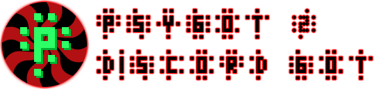

## Краткое описание

Бот для [Discord](https://discordapp.com), написан на .net 4.6 C#, с использование библиотеки [Discord.Net](https://github.com/RogueException/Discord.Net). Монолит, но имеет функцию самообновления.

## Подробнее

Это вторая версия бота. [Первая](https://github.com/EFLFE/Psybot-archived-) использовала 'модули' как отдельные .dll файлы. Это было удобно, но net core на но время не мог выгружать модули. Пришлось переписать под .net 4.6.

ЗЫ: Ненавижу dot net за то, что консольное приложение компилируется в .dll файл.

## Стабильность

Отсуствует. Бот не проходил тестирование на стрес-тест (юнит-тесты для слабаков). Исходный код имеет такие страшные слова, как: async/await, lock, Activator.

Должен отметить, что этото бота (Я)[https://github.com/EFLFE] создавал лично для себя, своих нужд, и просто потому что почему бы и нет. Сейчас он находится на пару не самых активных дискорд серверах, и чувствует себя там хорошо. Да и модулей не так то и много.

## Зачем от тогда здесь?

Мне нужно, что бы бот работал 24/7 на моём линукс сервере. И будет проще от туда сделать пул проекта и собрать.

Или вдруг вы тоже делаете бота на c# и ищете примеры для каких то функций, то вот вам пример ~~из костылей других проектов~~.

## Что если я тоже ~~безумец~~ хочу себе этого бота?

Такая вероятность крайне мала, но напиiу пару замечаний на этот счёт (что бы самому не забыть):

* Токен файл должен быть в директории с прогой, иметь название `token` и содержать в себе текстовую строку самого токена;
* Конфиг файл `config.ini` (создаётся автоматически) должен иметь хотя бы ваш ID профиль - `AdminID`;
* Следующий пул может сломать модули к чёртовой бабушки.
